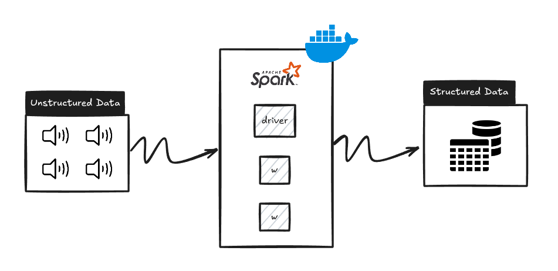
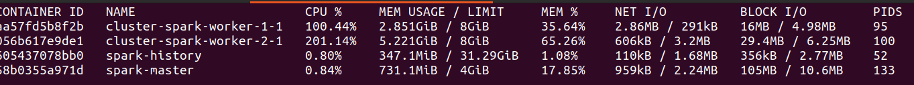
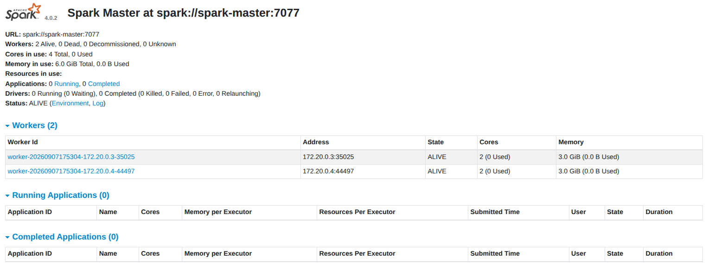
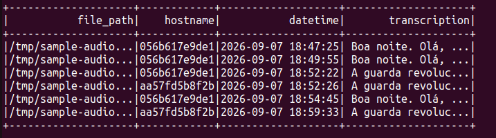

# Audio Para Texto

---

## 1.0. Introdução



O presente repositório tem como objetivo demonstrar a utilização do **Faster Whisper** para realizar a transcrição automática de conversações em arquivos de áudio, convertendo o conteúdo falado em uma estrutura textual organizada e posteriormente adequada para análise e processamento de dados.

O **Whisper** é um modelo de reconhecimento automático de fala (*Automatic Speech Recognition — ASR*) desenvolvido para realizar a transcrição de áudio em texto. Neste projeto, foi utilizada a implementação **Faster Whisper**, que utiliza o [CTranslate2](https://github.com/OpenNMT/CTranslate2) como engine de inferência, proporcionando uma execução mais eficiente do modelo em diferentes ambientes computacionais.

Os arquivos de áudio utilizados neste projeto possuem a conversação concentrada em um único canal. Dessa forma, não foi necessário realizar um processo adicional de separação ou análise de múltiplos canais (*multi-channel audio*). Essa característica também simplifica o pipeline de processamento, uma vez que o áudio pode ser encaminhado diretamente para o modelo de reconhecimento de fala.

Da mesma forma, não foi necessário aplicar uma etapa extensa de pré-processamento de áudio utilizando bibliotecas especializadas, como `librosa`. O objetivo principal deste projeto é avaliar a capacidade de utilização do modelo de transcrição em conjunto com uma infraestrutura de processamento distribuído.

Além da execução convencional do Faster Whisper, este repositório apresenta uma abordagem utilizando **Apache Spark** para distribuir o processamento dos arquivos de áudio. Dessa maneira, busca-se combinar a capacidade de processamento paralelo de uma engine distribuída com a capacidade de reconhecimento de fala do Faster Whisper.

---

## 2.0. Cluster Spark



Para executar a etapa de processamento distribuído, foi criado um cluster **Apache Spark** utilizando **Docker Compose**.

O ambiente é composto por:

* **1 nó Driver**, responsável pela coordenação das aplicações Spark;
* **2 nós Workers**, responsáveis pela execução das tarefas distribuídas;
* Comunicação entre os containers através da rede criada pelo Docker Compose;
* **Python 3.10.12** como ambiente de execução Python;
* **Scala 2.13.16** para o ambiente Spark;
* Imagens Docker construídas de forma personalizada para atender às necessidades específicas do projeto.

A utilização do Docker permite reproduzir o ambiente de execução de maneira mais consistente, evitando que diferenças entre sistemas operacionais ou versões de dependências interfiram diretamente na execução do pipeline.



O cluster foi construído de forma semelhante a outras infraestruturas Spark utilizadas anteriormente, porém com as dependências necessárias para executar o processo de transcrição utilizando o Faster Whisper.

A principal finalidade dessa estrutura não é apenas executar o modelo de transcrição, mas demonstrar como uma aplicação de **Machine Learning/Deep Learning pode ser integrada a uma infraestrutura de processamento distribuído**.

Um pequeno tutorial está disponível no diretório `cluster`, contendo as instruções necessárias para reproduzir o ambiente utilizando Docker Compose e executar o processo de transcrição.

---

## 3.0. Processamento Distribuído

Uma das principais características deste projeto é a utilização do Spark para distribuir o processamento dos arquivos de áudio.

Em uma execução tradicional, os arquivos seriam processados sequencialmente por uma única aplicação:

```text
Áudio 1 → Whisper
Áudio 2 → Whisper
Áudio 3 → Whisper
Áudio 4 → Whisper
...
```

Em um ambiente distribuído, o Spark pode dividir o conjunto de arquivos entre diferentes tarefas e executores:

```text
                 Spark Driver
                     │
          ┌──────────┴──────────┐
          │                     │
      Worker 01             Worker 02
          │                     │
     ┌────┴────┐           ┌────┴────┐
   Áudio 1   Áudio 2      Áudio 3   Áudio 4
```

---

## 4.0. Resultados



A partir de uma base de arquivos de áudio, foi possível combinar técnicas de **Machine Learning**, reconhecimento automático de fala e **computação distribuída** para transformar dados de áudio não estruturados em uma estrutura textual e posteriormente tabular.

O resultado final deixa de ser simplesmente um conjunto de arquivos de áudio e passa a possuir informações que podem ser armazenadas e processadas de maneira estruturada.

Dessa forma, o áudio passa a ser tratado como uma fonte de dados que pode ser incorporada a uma arquitetura de dados maior.
